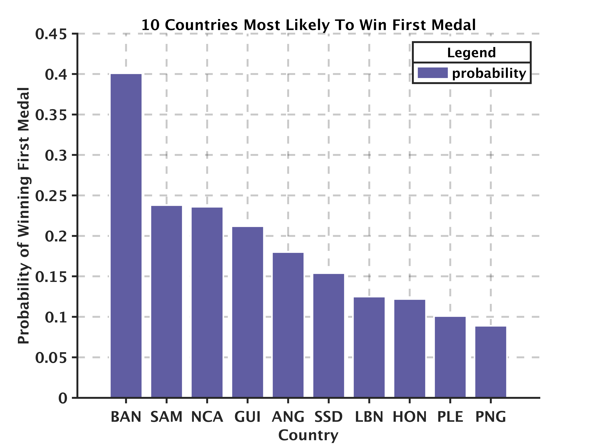
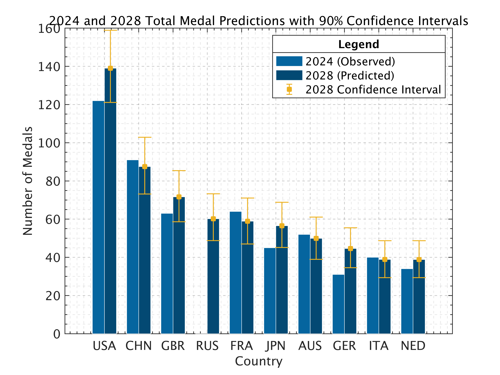

# 2028 LA Olympics: Who Will Dominate the Medal Count?

## 👨‍💻 Authors

🧑‍🤝‍🧑**Team #2510006** – 🏅 **Outstanding Winner, MCM/ICM 2025**  
	📍 **Problem C – Olympic Medal Forecasting**  
	🏫 **Southern University of Science and Technology (SUSTech)**

- 👤 **Li Yifan**
- 👤 **Rui Yuhan**
- 👤 **Lou Yibin**

------

## 0. Workflow & Result

<figure style="text-align: center;">
  
  <figcaption><b>Figure 1.</b> Workflow</figcaption>
</figure>

<figure style="text-align: center;">
  
  <figcaption><b>Figure 2.</b> 10 countries most likely to win first medal</figcaption>
</figure>

<figure style="text-align: center;">
  
  <figcaption><b>Figure 3.</b> 2024 and 2028 total medal predictions with 90% confidence intervals</figcaption>
</figure>

---

## 🧠 1. Executive Summary

The paper proposes a **comprehensive, data‑driven framework** to forecast total and gold‑medal counts (with 90 % confidence intervals) for every country at the 2028 Los Angeles Olympics.  A hybrid of **Linear Regression, ARIMA (0,0,2)** and **Random Forest** models captures linear trends, cyclical effects and non‑linear interactions, respectively.  Monte‑Carlo simulations are used for brand‑new events, and Poisson inference converts expected values into medal‑count distributions.  The model predicts, for example, that the United States will collect **≈ 139 total / 55 gold** medals, while China may decline after losing key weight‑lifting events.

------

## 🎯 2. Problem & Tasks

Given historical Olympic data, the authors address three intertwined tasks:

| Task                         | Goal                                                         |
| ---------------------------- | ------------------------------------------------------------ |
| 🥇 **1. Medal Prediction**    | Predict 2028 total & gold medals per country with 90 % CIs; compare to 2024 outcomes; estimate first‑time medal nations; study event–medal relationships & host‑added sports. |
| 🧑‍🏫 **2. Great‑Coach Effect** | Quantify whether hiring celebrated coaches changes medal yields and recommend candidate pairings. |
| 💡 **3. Insights & Policy**   | Link medals to GDP and advise smaller nations on cost‑effective sports investments. |

------

## 📦 3. Data & Assumptions

- Olympic results 1896‑2024, enriched with country GDP and world‑ranking datasets for new sports.
- Key assumptions include:
  - 🆕 **Five new sports** (Baseball/Softball, Lacrosse, Cricket, Squash, Flag Football) added by the host.
  - ❌ **Four sports removed** (Breakdancing, Boxing, Weightlifting, Modern Pentathlon).
  - 🧍‍♂️ Athletes keep their nationalities; external shocks (politics, doping) are ignored.

------

## 🔧 4. Methodology

### 🧹 4.1 Data Processing

- **K‑means (K = 6)** clusters ~70 events into Aquatics, Ball, Athletics, Gymnastics/Acrobatics, Martial‑Arts, Motorsports, enabling event‑type‑specific modeling.
- Countries are split into *medal* vs *non‑medal* groups; hosts handled separately to capture home advantage.

### 📈 4.2 Medal‑Count Forecast

- For returning events, medal trajectories are regressed on year if correlation ≥ 0.5, else averaged; categorical equations â_j etc. formalize the rule‑set.
- 📊 **Host boost** is estimated from historical host increments, then applied to U.S. predictions.
- 🧠 **ARIMA + Random Forest Ensemble** models the time‑series of “first‑medal” nations, giving 95 % CI = [2.58, 4.87] for 2028 newcomers.  Diagnostic tests (ADF = ‑4.01, p = 0.0014; Ljung‑Box p > 0.05) confirm residual whiteness and normality.
- 🎲 **Monte‑Carlo (1 M runs/event)** and logistic models convert world rankings into medal probabilities for each of the ten new events (e.g., Bangladesh cricket).

------

## 📊 5. Key Results

- **Top Nations:** U.S. most likely to increase medals; China shows largest projected gold decline; Russia’s totals remain flat due to 2024 sanctions baseline.
- **Stability Analysis:** U.S. and Russia predictions stay constant across correlation thresholds r ∈ [0.3, 0.7], whereas China drops from 96→77 total medals as r grows.
- **GDP Link:** Medal count correlates strongly with log‑GDP (r ≈ 0.83).
- **First‑Medal Prospects:** Bangladesh and Nicaragua emerge as leading contenders via cricket and baseball/softball, respectively.

------

## 🧑‍🏫 6. Great‑Coach Effect

Fisher’s Exact Test on historic coaching changes (Lang Ping, Béla Károlyi) yields confidence levels up to **P ≈ 0.9993**, evidencing significant medal lifts. Recommended matches: **China‑Volleyball, India‑Athletics, Brazil‑Gymnastics**. Expected impact ranges from tactical innovation to scientific training upgrades.

------

## 🪪 7. License

This project is licensed under the [MIT License](./LICENSE) © 2025 Team #2510006.

------

## 📚 8. How to Cite

If you use this repository, please cite the original MCM/ICM paper:

> 🧑‍🤝‍🧑 Team #2510006, “2028 LA Olympics: Who Will Dominate the Medal Count?”, 🏅 Outstanding Winner, MCM/ICM 2025.
